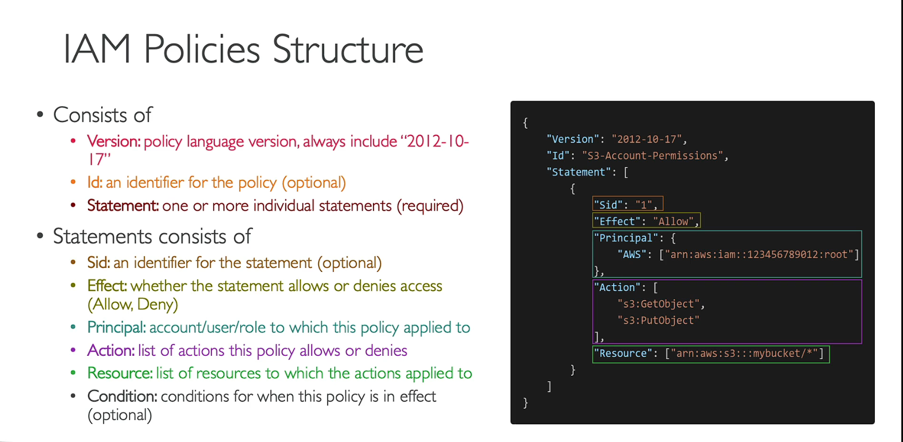

# Identity & Access Management (IAM)

* The Global Service in IAM allows IAM entities like roles to be used in any region without the need for recreation.
 * This means that if you create a role in one region, you can use that same role in any other region without any additional configuration.
 * 
 * This feature provides flexibility and simplifies the management of IAM entities across different regions in AWS.
 
- Global Service (IAM entities like roles can be used in any region without recreation)

## Users & Groups

* Groups are collections of users and have policies attached to them
* Groups cannot be nested
- User can belong to multiple groups
* User doesn't have to belong to a group
- Root User has full access to the account
- IAM User has limited permission to the account
- You should log in as an IAM user with admin access even if you have root access. This is just to be sure that nothing goes wrong by accident.
- An IAM Group is not an identity and cannot be identified as a principal in an IAM policy
- Only users and services can assume a role (not groups)
- A new IAM user created using the AWS CLI or AWS API has no AWS credentials

## Policies
- Policies are JSON documents that outline permissions for users, groups or roles
- Two types:
  - User based policies:
    - IAM policies define which API calls should be allowed for a specific user
  - Resource based policies:
    - Control access to an AWS resource
    - Grant the specified principal permission to perform actions on the resource and define under what conditions this applies
- An IAM principal can access a resource if the user policy ALLOWS it OR the resource policy ALLOWS it AND there’s no explicit DENY.
- Policies assigned to a user are called inline policies
- Follow least privilege principle for IAM Policies

### Policy Structure

## Trust Policies
- Defines which principal entities (accounts, users, roles, federated users) can assume the role
- An IAM role is both an identity and a resource that supports resource-based policies.
- You must attach both a trust policy and an identity-based policy to an IAM role.
- The IAM service supports only one type of resource-based policy called a role trust policy, which is attached to an IAM role.

## Roles
- Collection of policies for AWS services
- If you are going to use an IAM Service Role with Amazon EC2 or another AWS service that uses Amazon EC2, you must store the role in an instance profile. When you create an IAM service role for EC2, the role automatically has EC2 identified as a trusted entity.

## Protect IAM Accounts
- **Password Policy**
  - Used to enforce standards for password
  - password rotation
  - password reuse
  - Prevents brute force attack
- **Multi Factor Authentication (MFA)**
  - Both root user and IAM users should use MFA

## Reporting Tools
- **Credentials Report**
  - lists all the users and the status of their credentials (MFA, password rotation, etc.)
  - account level - used to audit security for all the users
- **Access Advisor**
  - shows the service permissions granted to a user and when those services were last accessed
  - user-level
  - used to revise policies for a specific user

## Access Keys
- Need to use access keys for AWS CLI and SDK
- Don't share access keys with anyone (every user can generate their own access keys)
- Access keys are only shown once and if you lose them you need to generate a new access key
- Access Key ID ~ username
- Secret Access Key ~ password
- Long-term credentials
    - Don’t update manually
- IAM User don’t need username and password - for CLI access key is enough
- IAM User can have up to two access keys
    - Can be created, deleted, made inactive or made active

### Access Keys consist of two parts

- Both are provided when created an access key
- These are only provided once - no ability to get access to the keys again. Need to be stored safely.
- Both parts are used when accessing AWS via CLI
- Access keys need to be deleted and recreated if they are leaked
- Possible to have two sets of keys such that you can create a new one, update all applications using the keys and then delete the old set

**Access Key ID:** ABABABABABABABA

**Secret Access Key:** oierWRhoefWORIOF/DFLWAnljef

## Guidelines
- Use root account only for account setup
- 1 physical user = 1 IAM user
- Enforce MFA for both root and IAM users
- Never share IAM credentials & Access Keys

## Policy Simulator
- Online tool that allows us to check what API calls an IAM User, Group or Role is allowed to perform based on the permissions they have.

## Permission Boundaries
- Set the maximum permissions an IAM entity can get
- Can be applied to users and roles (not groups)
- Used to ensure some users can’t escalate their privileges (make themselves admin)

## Assume Role vs Resource-based Policy
- When you assume an IAM Role, you give up your original permissions and take the permissions assigned to the role
- When using a resource-based policy, the principal doesn’t have to give up their permissions
