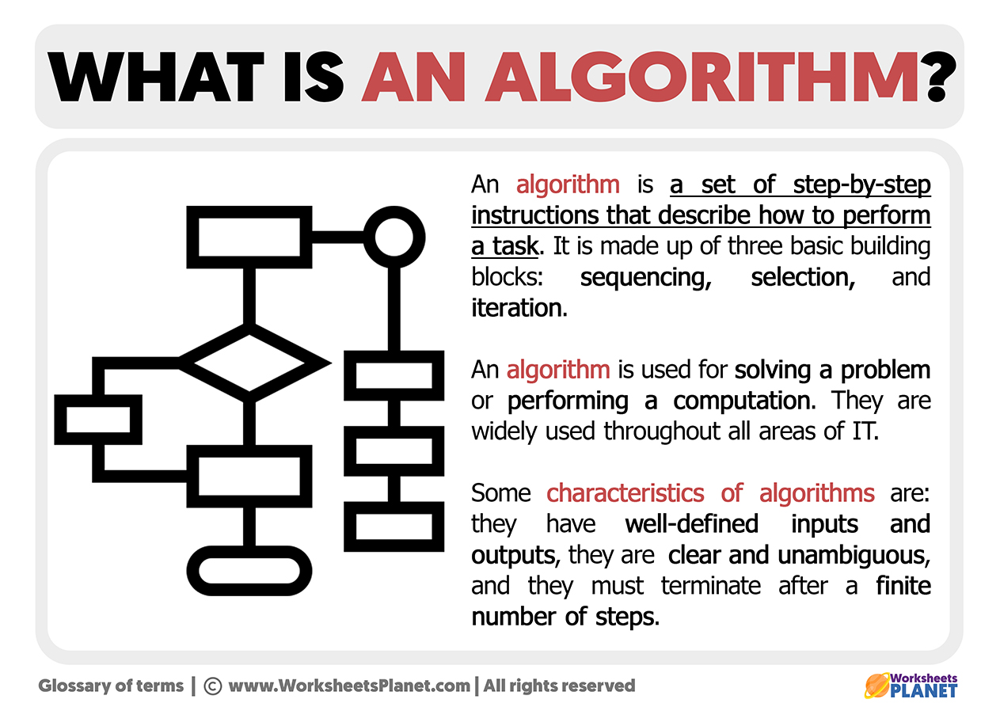

# Algorithm

An ==algorithm== is a step-by-step procedure or a set of rules for solving a specific problem or accomplishing a specific task. It is a fundamental concept in computer science and is used to design efficient and effective solutions to various computational problems.

## Characteristics of an Algorithm

- **Input**: An algorithm takes input, which can be in the form of data, variables, or parameters.

- **Output**: An algorithm produces output, which can be a result, a solution, or a transformed input.

- **Definiteness**: An algorithm must have clear and unambiguous instructions that can be followed precisely.

- **Finiteness**: An algorithm must terminate after a finite number of steps.

- **Feasibility**: An algorithm must be practical and feasible to implement using the available resources.

## Types of Algorithms

There are various types of algorithms, each designed to solve different types of problems. Some common types include:

- **Sorting Algorithms**: These algorithms arrange a list of elements in a specific order, such as ascending or descending.

- **Searching Algorithms**: These algorithms find the location or occurrence of a specific element within a collection of elements.

- **Graph Algorithms**: These algorithms analyze and manipulate graphs, which are a collection of nodes and edges.

- **Dynamic Programming Algorithms**: These algorithms break down complex problems into simpler subproblems and solve them recursively.

- **Greedy Algorithms**: These algorithms make locally optimal choices at each step to find a global optimum.

- **Backtracking Algorithms**: These algorithms explore all possible solutions by incrementally building a solution and undoing choices when necessary.

## Importance of Algorithms

Algorithms are essential in computer science and programming for the following reasons:

- They provide a systematic approach to problem-solving.

- They help in optimizing resource usage, such as time and memory.

- They enable the development of efficient and scalable software applications.

- They are the foundation for various data structures and algorithms used in software development.

- They are used in various domains, including artificial intelligence, machine learning, cryptography, and more.

Remember, understanding and implementing algorithms is crucial for any programmer or software engineer to become proficient in solving complex problems efficiently.
